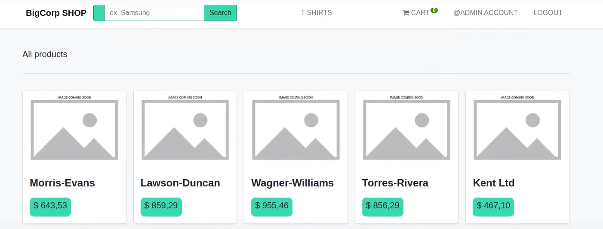

# Онлайн магазин E-commerce

## Описание
Проект электронной коммерции на Django с API и различными функциями.

## Установка
Для запуска проекта следуйте следующим шагам:
1. Сборка проекта локально с использованием Docker-compose: docker-compose build
2. Запуск проекта: docker-compose up

## Использование 
1. После запуска проекта создайте суперпользователя, используя следующую команду: $ sudo docker exec -it bigcorp-backend python manage.py createsuperuser
2. Войдите в интерфейс администратора в вашем браузере и вручную создайте хотя бы одну категорию для товаров.
3. Создайте продукты, используя следующую команду: $ sudo docker exec -it bigcorp-backend python manage.py fakeproducts

## Технологии
- Python
- JavaScript
- Ajax
- CSS
- HTML
- Postgres
- Celery Beat
- Celery Result
- Celery
- Redis Broker
- Django Htmx
- Nginx
- Gunicorn
- API
- Swagger and Redoc Docs
- Celery Flower
- Stripe
- Yookassa
- Django Rest Framework
- Docker
- Docker Compose
- GitHub Actions
- Git

